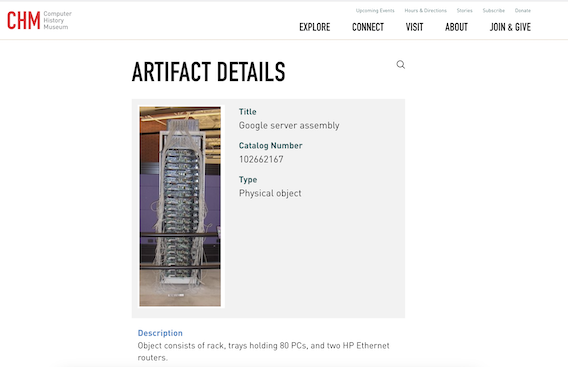

# Data Wrangling in Python

## Sidharth Shah
Fafadia Tech
{Twitter: **@iamsidd**, Github: **sidharthshah**, Email: **sidharth@fafadiatech.com**}

Slides: https://github.com/fafadiatech/talks/tree/master/VCET

---

## Introduction

### What does it mean?

> Data wrangling is the process of removing errors and combining complex data sets to make them more accessible and easier to analyze.

---

## Some motivating examples

### Search Engines



---

### Price Monitoring


---

### Dynamic Pricing Engine


--- 

###  Creating Training Datasets


--- 

### How does Google Work 

Key components (at very high level)

1. Crawler: Fetches pages from internet
1. Indexer: Created inverted index term -> document
1. UI: Glue everything together

---

### Ways to extract data

1. Crawler
1. API
1. Downloadable dataset

----

### Toy Task

1. Input: List of all faculty pages
2. Output: CSV/TSV files tabulated results

---

### Minimalist crawler

```python
import requests

URL = "https://vcet.edu.in/"
response = requests.get(URL)
print(response.status_code)
print(response.text)
```

But wait.... this doesn't work

---

### Lets try one more time

```python
import requests

URL = "https://vcet.edu.in/"
headers={'User-Agent': 'Mozilla/5.0 (Windows NT 10.0; Win64; x64) AppleWebKit/537.36 (KHTML, like Gecko) Chrome/102.0.0.0 Safari/537.36'}
response = requests.get(URL, headers=headers)
print(response.status_code)
print(response.text)
```

---

### What does a crawler look like?

```python
frontier = []

while len(frontier) > 1:
    url = frontier.pop()
    html = download_page(url)
    all_urls = extract_urls(html)
    frontier.extend(all_urls)
```

### Into RegEx rabbit hole

Places where regex are used extensively

1. Validation Rules {E.g. Email, Phone, Addresses}
2. Scraping {E.g. Extracting Prices, Text Snippets}
3. Translation {E.g. Replacing all upper cases to lower case}
4. Parsing Logs {E.g. Parsing Nginx and Apache logs}

---

Key components of RegEx

1. Expression
1. Quantifiers
1. Logic

---

Expression

1. `d` : Digits {0-9}
2. `w` : Word character this includes Alphabets {Case Insensitive}, Digits and Underscore
3. `s` : White spaces {including tabs, new line and character returns}

Note: Capital of above character match inverses. E.g. ‘D’ will match anything that is not a digit

---

Quantifiers

1. `.` : Matches occurance of any character
2. `?` : Optional Match
3. `+` : Match atleast one
4. `{x}` : Matches occurances of expression Exactly x number of times
5. `{x, y}` : Matches occurances of expression Range x, y number of times

---

Logic

1. `|` : Matches sub-expressions within the group
2. `(…)` : Encapsulate sub-expressions in a group
3. `^` : If used at starting of an expression it means “at the start”
4. `^` : If used in a group it negates

---

Class Characters

1. `[]`: Matches any of the character
2. `[a-z]`: Ranges of characters between a and z

---

Things to keep in mind while working with RegEx

1. RegEx are greedy by default {That means it tries to extract as much as possible until it conforms to a pattern even when a smaller part would have been syntactically sufficient.}
2. When writing regex make sure you test for positive and negative test cases

---

### Examples

#### findall

```python
import re
text_snippet = "there was a PEACH who PINCH, in return punch were flying around"
# re.compile compiles regex into an objects
# this makes it easier to work with regex
# re.IGNORECASE is a flag, you can have multiple such flags
pch_regex = re.compile(r"p.{1,3}ch", re.IGNORECASE)
for current_match in pch_regex.findall(text_snippet):
    print (current_match)
```

----

#### search


```python
import re
def validate_email(current_email):
    """
    check if email is valid
    """
    email_re = re.compile(r"\w+\@\w+\.(com|co\.in)", re.IGNORECASE)
    # .search() method is used to TEST if regex matches at all
    return email_re.search(current_email) is not None
print validate_email("spammy@gmail.com")
print validate_email("spammy@.co")
```
--- 

#### finditer


```python
import re
text_snippet = "there was a PEACH who PINCH, in return punch were flying around"
pch_regex = re.compile(r"p.{1,3}ch", re.IGNORECASE)
for current_match in pch_regex.finditer(text_snippet):
    print "Starts at:%d, Ends at:%d" % (current_match.start(), current_match.end())
```

---

### BeautifulSoup4

Why use it?

1. RegEx have limitation
1. All web is HTML, everything is Tree
1. Make life easier

----

```python
def extract_faculty(current):
    result = {}
    name = current.find('h2').text.strip()
    title = current.find('div', {'class': 'elementor-text-editor'})
    if not title:
        title = current.find("p")
    title = title.text.strip()
    email = "".join(extract_email(current.text))
    
    result['name'] = name
    result['title'] = title
    result['email'] = email
    return [result]
```

---

### Real world challenges

1. How not to DDoS?
1. Distributed Crawling
1. Avoiding duplicates
1. Ensure sustained performance