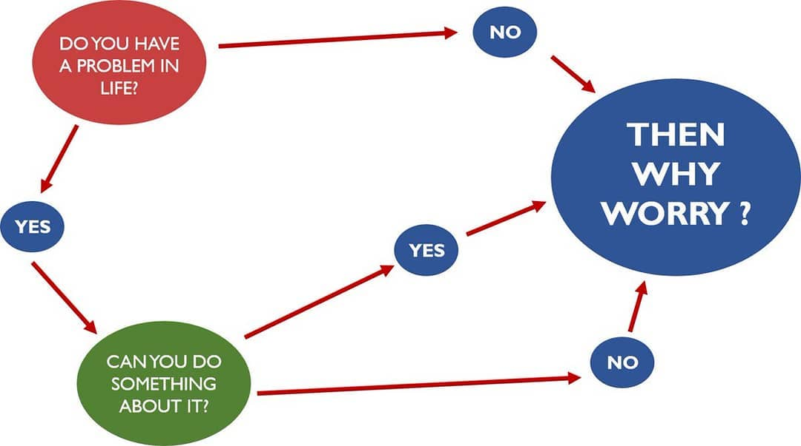
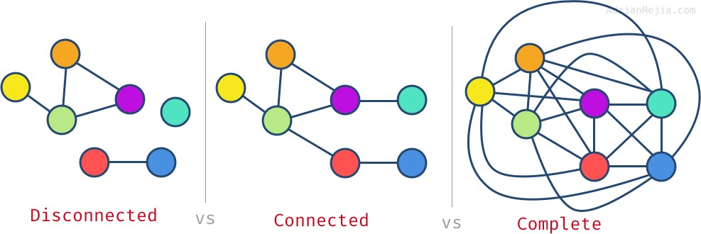
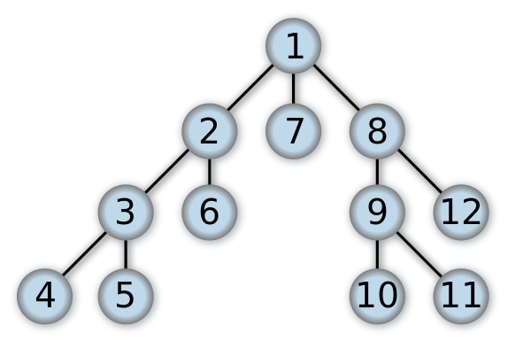
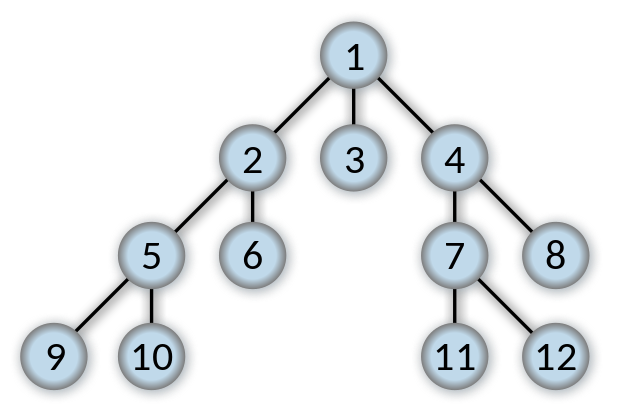
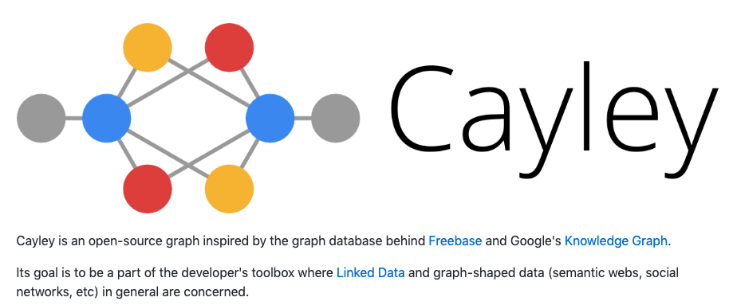
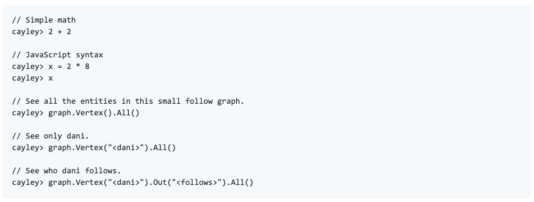

# Graph algorithms in Swift

## Sidharth Shah,
Fafadia Tech

---

## Introduction

### Intutive Explaination

Graph is pretty common data-structure in computer science. It has many real-world applications.

---

Graphs are representation that specify:

1. Things aka **Verticies/Nodes** {which it represents}
1. Structure aka **Edges** {in form inteconnection}

Good reference for getting started: [Graph Data Structures for Beginners](https://adrianmejia.com/blog/2018/05/14/data-structures-for-beginners-graphs-time-complexity-tutorial/#.WyA_46kQfFs.reddit)

---

### Is Tree and Graph same?

Nope, trees and graphs are **not same**. However Trees can be considered speical kind of Graphs. So Graphs is like super-set of Trees. 

1. Graphs don't have strict levels
1. Trees mostly have stricter levels

---

### Classification of Graphs

* Undirected vs Directed

---

* Cyclic vs Acyclic

---

* Disconncted vs Connected vs Complete

---

### Few uses of Graphs in our daily life include:

1. [Autocomplete](https://en.wikipedia.org/wiki/Trie)
1. [Google Maps](https://www.quora.com/How-does-the-algorithm-of-Google-Maps-work)
1. [Facebook's "You may know" suggestions](https://blogs.cornell.edu/info2040/2018/09/16/facebook-a-triadic-closure-success/)
1. XCode
    1. [Detecting cyclic imports/references](https://stackabuse.com/python-circular-imports/)
    1. [Abstract Syntax Trees](https://en.wikipedia.org/wiki/Abstract_syntax_tree)
    1. [Static Analysis via Call Graphs](https://en.wikipedia.org/wiki/Call_graph)
    1. [Optimization: Notes on Graph Algorithms
Used in Optimizing Compilers](https://www.cs.umb.edu/~offner/files/flow_graph.pdf)
1. Strategy Games
    1. [StarCraft: AlphaStar](https://deepmind.com/blog/alphastar-mastering-real-time-strategy-game-starcraft-ii/)
    1. [DOTA: OpenAI Five](https://openai.com/blog/openai-five/)
1. Pretty much most of Deep Learning Algorithms

---

## Store Graphs using

1. Adjacency List
1. Adjacency Matrix

---

## Motivation

Lets say you work at one of the space agencies, your boss has asked you to build AI for robotic probe for soil-sampling different area of terrains and report back results.

---

### Start with Simple one location

You will be given

1. Starting Location
2. Map of the World {in form of a grid}, each cell
    1. Traversable
    1. Not-traversable
3. Target Location

---

### Useful Abstractions

1. **World**: Representation of maps as two-dimensional world
1. **State{s}**: Represent one of many possible configurations of world
1. **State Space**: Represents all of possible configurations of world
1. **Action{s}**: Mapping from current state to Child States
1. **Child States**: Valida states that be generated from *Current State*
1. **Target State**: Final state that we're trying to reach

---

## DFS Algorithm

Now that we've defined our core classes, we will start with Algorithm called [DFS: Depth First Search](https://en.wikipedia.org/wiki/Depth-first_search)

---

## BFS Algorithm

[BFS: Breath-First Search](https://en.wikipedia.org/wiki/Breadth-first_search) is an alternative, which expands all nodes at **current** level **before** going to **next** level

---

## Fun Fact: Graph Databases

### https://github.com/cayleygraph/cayley
---

---

## Summarize

1. Define **states** and **actions**
2. Define **child state generator**
3. Sepcify **start** and **termination** state
4. Use any **Search Algo** to find solution

---

## References

1. [Graph Data Structures for Beginners](https://adrianmejia.com/blog/2018/05/14/data-structures-for-beginners-graphs-time-complexity-tutorial/#Adjacency-List-Graph-OO-Implementation)
1. [Wikipedia: Depth First Search](https://en.wikipedia.org/wiki/Depth-first_search)
1. [Algorithms: Graph Search, DFS and BFS](https://www.youtube.com/watch?v=zaBhtODEL0w)
1. [Introduction to A* Algorithm](https://www.redblobgames.com/pathfinding/a-star/introduction.html)